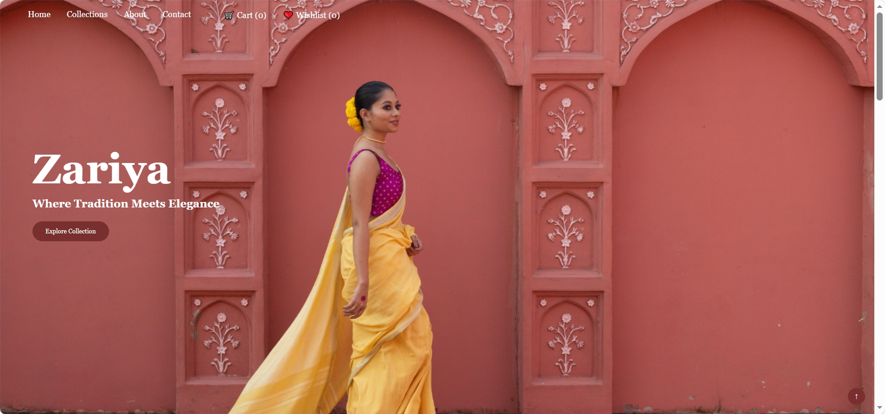
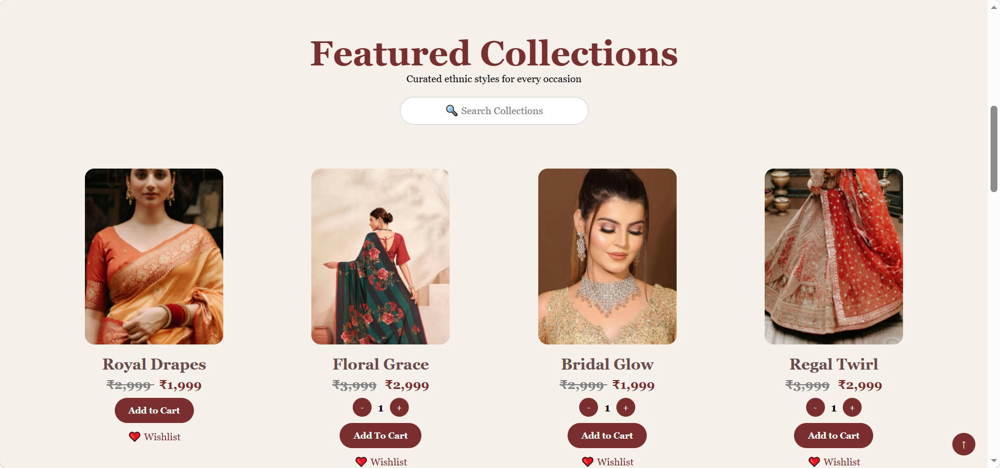
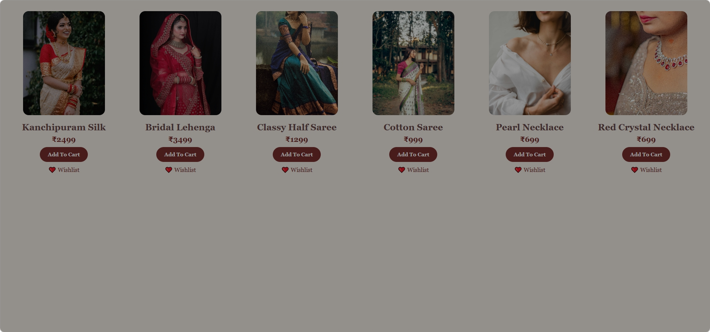
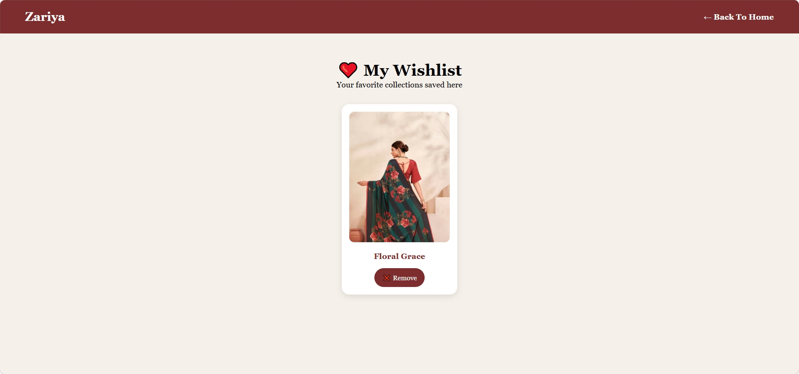

# 🌸 Zariya Boutique

Zariya Boutique is a modern ethnic fashion website showcasing elegant sarees, lehengas, jewelry, and traditional collections.

## 🚀 Live Demo
https://ramyaambati06.github.io/Zariya-boutique/

## ✨ Features

- Responsive Design
- Product Collection Showcase
- Search Functionality
- Shopping Cart
- Wishlist
- Quantity Selection
- Product Pricing
- Checkout Form
- Customer Testimonials
- Contact Form
- Local Storage Support

## 🛠️ Technologies Used

- HTML5
- CSS3
- JavaScript
- Local Storage
- GitHub Pages

## 📸 Screenshots

### Home Page

### Collections Page

### Wishlist Page

## 📂 Project Structure

Zariya-boutique/
│
├── index.html
├── collection.html
├── wishlist.html
├── style.css
├── script.js
├── README.md
└── images/
## 👩‍💻 Author

Ramya Ambati

GitHub: https://github.com/ramyaambati06
